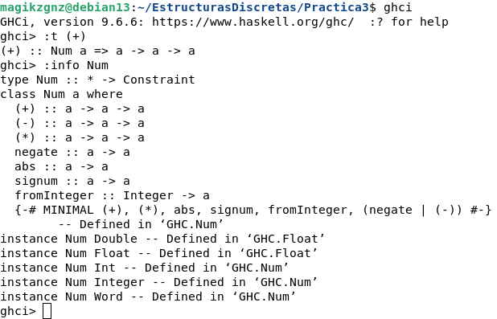

¿Cuál es la diferencia entre Num e Int?
Num es un *tipo de clase* que incluye todos los tipos numéricos como son Int, Float, Double etc...
Int es el *tipo específico de un número* en este caso de enteros.

Adjunto captura del ejemplo en ghci:

