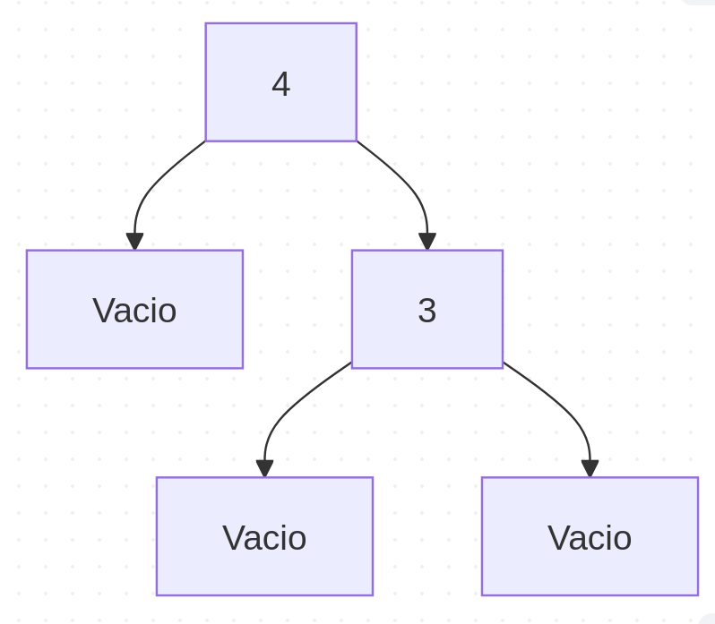
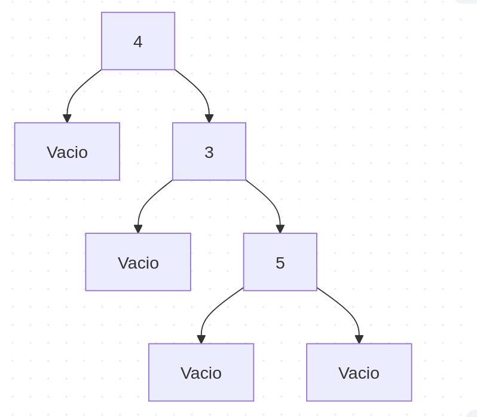
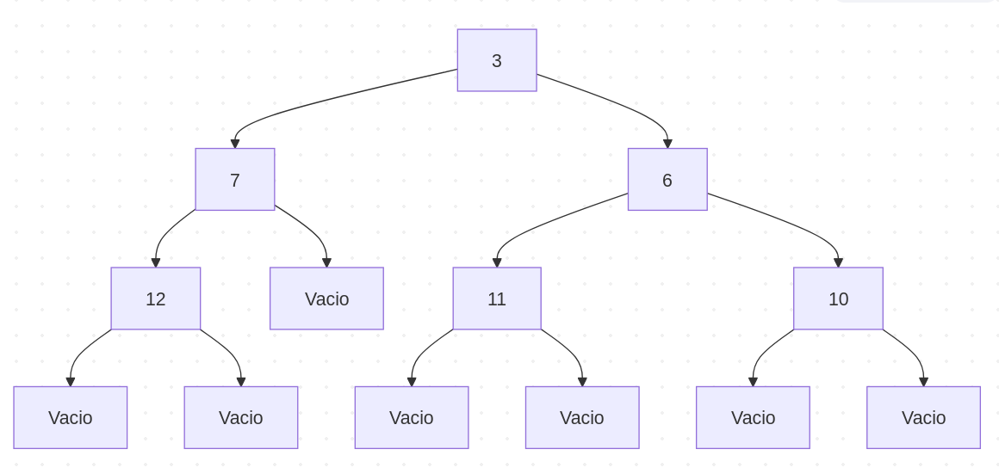

**Objetivo de la Práctica**
El objetivo fue lograr la implementación de funciones recursivas que usando arboles y listas no devolviera lo que nos pedia en las indicaciones del ejercicio.
**Tiempo Requerido**
El tiempo que me llevó hacer esta practica fue de 2 días
**Comentarios extra**
Lo que màs me costó como en casi todas las practiacs pasadas es hacer el uso de las funciones auxiliares y que si hagan lo que deben de hacer, de ahì en fuera un poquito tardadito hacer el README.

**Representaciones graficas de los arboles binarios**
Arbol 1 - graph TB R(("1")) I1(("2")) D1(("3")) I2(("4")) D2(("Ø")) I4((11)) D4((10)) I5(("0")) D5(("28")) R --> I1 R --> D1 I1 --> I2 I1 --> D2 D1 --> I4 D1 --> D4 I4 --> I5 I4 --> D5

Arbol 2 - graph TB R(("4")) I1(("7")) D1(("3")) I2(("9")) D2(("Ø")) I3(("15")) D3(("Ø")) R --> I1 R --> D1 I1 --> I2 I1 --> D2 I2 --> I3 I2 --> D3

**Representacion visual de los arboles**
a)

b)

c)
