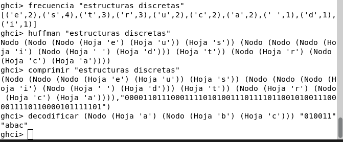

**Nombre del Proyecto** 🤓​
Codificación de Huffman (Variante)

**Objetivo** ✅​
El objetivo del proyecto fue entender esta variante de la codificación de huffman para así poder implementar o busar cómo crear las funciones que nos codifiquen, decodifiquen, compriman, nos den las frecuencias y creen nuestro arbol de huffman en base a una cadena de texto que nosotros pasemos, en ese caso del proyecto nuestras frases favoritas.

**Funcionamiento del proyecto** ⚙️​
Codificación 👨‍💻​
- 📊 Se cuentan las frecuencias de los caracteres en el texto que nos pasen, si un carácter se repite se cuenta el número de veces que aparece y se ordena de letras con mayor frecuencia a menor.
- 🌳 Se construye el árbol binario de Huffman, donde al inicio se encuentra la raíz, en parte del subárbol derecho se encuentran como hojas los símbolos o carácteres más repetidos y se ponen en la parte más alta del aŕbol y así hacia abajo con los menos repetidos. En el subárbol izquierdo sólo se encuentran los nodos vacíos.
- 🔑 Se recorren las ramas, el subárbol izquierdo va a ser: 0 = izquierda y el subárbol derecho: 1 = derecha) para asignar los códigos binarios.
- 📄 Se crea una tabla con los símbolos o carácteres y sus respectivas frecuencias.

Decodificación 👨‍💻​
- 📥 Se recibe la cadena comprimida en bits y el árbol de Huffman.
- 🧭 Se sigue el recorrido del árbol según cada bit.
- 📝 Al llegar a una hoja esta regresa el carácter que se encuentra ahí.
- 🔄 Se repite hasta formar el texto completo.

**Ejecución** ​👀​
Si quieres llevar a cabo la ejecución o ver cómo se ve este proyecto por tu propia cuenta haz lo siguiente:
 1- Clona mi repositorio que ahí viene la sección de proyecto y ponlo con este comando en tu terminal:
 *git clone https://github.com/MarioAlberto1234/EstructurasDiscretas/tree/main/Proyecto*
 2- compila el proyecto escribiendo ghci en tu terminal seguido de el nombre del archivo Proyecto.hs
 *ghci Proyecto.hs*
 3. Usa o escribe el nombre de la función que quieras observar y ingresa una frase o un texto como tú lo desees. Por ejemplo se vería algo así:
 *ghci > frecuencias "la frase o texto que quieras*
 4. Pulsa enter y ve el resultado

**Ejemplo de cada algoritmo** 🔍​

 

**Tiempo Requerido** ​⏰​
El tiempo requerido del proyecto fue de varios días, exactamente no lo sé porque lo hacía cada que podía, pero si hacía una hora cada vez que abría el proyecto.

**Comentarios extra** ​📝​
Este proyecto no fue complicado pero si muy tedioso en el hecho de realizar el archivo latex, investigar para responder preguntas y la resolución de las actividades de implementación, pero más allá de eso, fue muy útil el proyecto para entender latex, esta variante de codificación de huffman y la investigación por cuenta propia, me quedo satifecho con mi proyecto.

